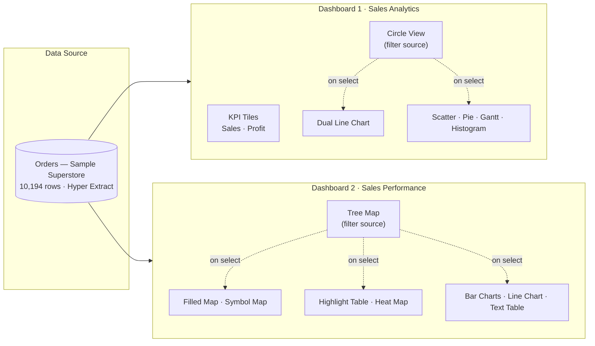
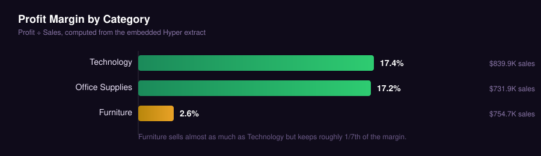
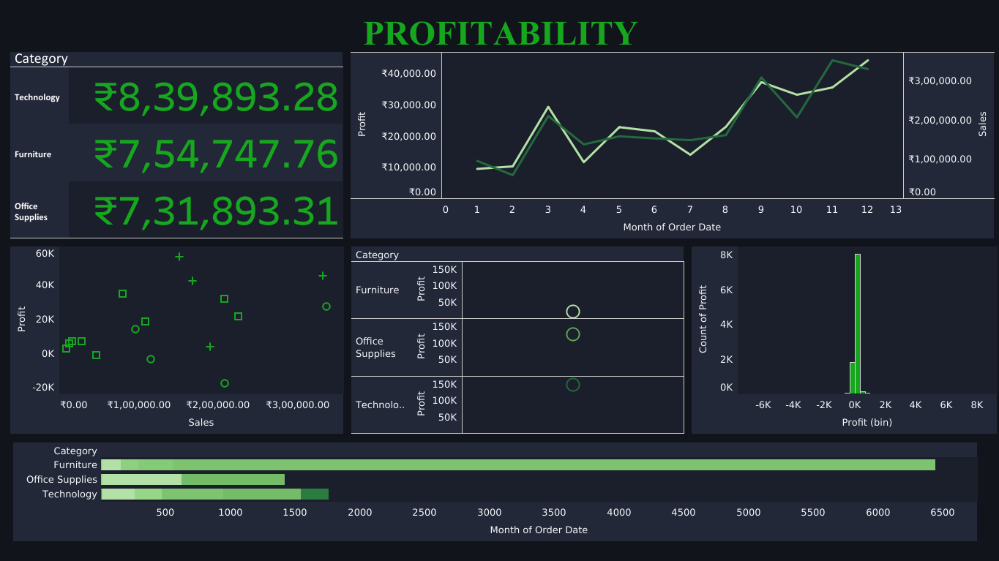
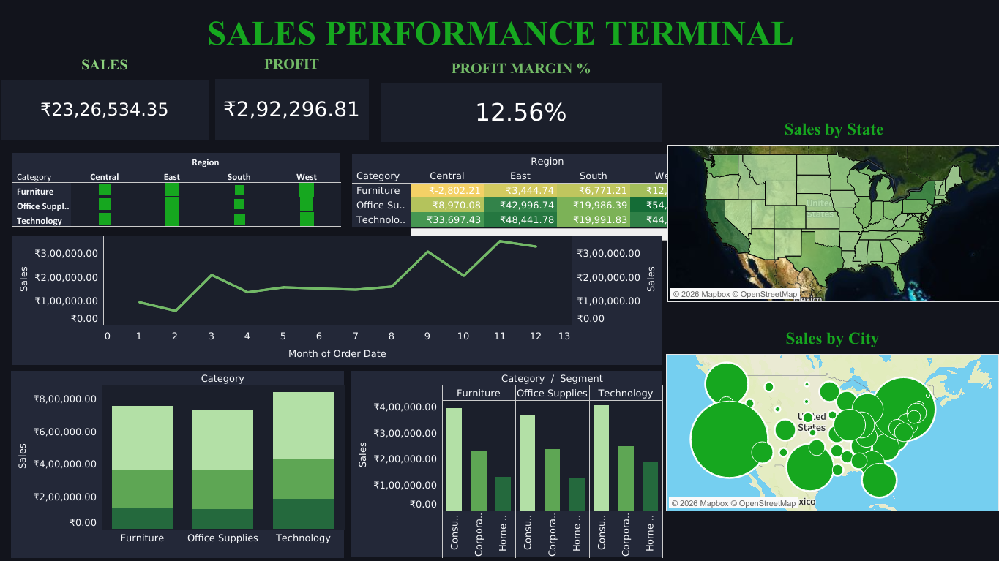

<div align="center">


<br><br>


</div>

<br>

> [!NOTE]
> Every figure in this document is queried directly from the workbook's embedded data extract — not estimated, not rounded for effect, and not copied from a template. See [Data Verification](#data-verification) for how.

<br>

<table align="center">
<tr><td>

**In one line:** the business converts $2.32M in sales into a **12.56% blended margin** — but that average hides a category, a region, and two sub-categories that are actively pulling the number down. This project exists to show exactly which ones, and why.

</td></tr>
</table>

---

<div align="center">

**Contents**

[Diagnostic Brief](#diagnostic-brief) · [The Dashboards](#the-dashboards) · [Anatomy of Dashboard 1](#anatomy--sales-analytics) · [Anatomy of Dashboard 2](#anatomy--sales-performance) · [Scorecard](#analyst-scorecard) · [Findings](#findings-that-matter) · [Field Reference](#field-reference) <sup>(expand)</sup> · [How to Open](#how-to-open) · [Screenshots](#screenshots) · [Methodology](#methodology--course-alignment) · [Roadmap](#roadmap) · [Author](#author)

</div>

---

## Diagnostic Brief

<table>
<tr>
<td width="33%" valign="top">

**The Question**
Three product categories, four regions, one dataset. Is revenue growth actually translating into profit growth — or is part of the business quietly subsidizing another part?

</td>
<td width="33%" valign="top">

**The Approach**
Two linked Tableau dashboards: one diagnosing *trend and distribution*, the other diagnosing *where geographically and categorically*. Every chart maps to a specific sub-question, not decoration.

</td>
<td width="33%" valign="top">

**The Answer**
Yes — and it's isolable. Furniture, specifically Tables and Bookcases, and specifically in the Central region, is where the margin is leaking. See [Findings](#findings-that-matter).

</td>
</tr>
</table>

---

## The Dashboards



Each dashboard has a designated **anchor visual** — Circle View on Sales Analytics, Tree Map on Sales Performance — that drives an on-select filter action into every other chart on its dashboard. Nothing is filtered manually; clicking a category *is* the filter.

---

## Anatomy — Sales Analytics

<div align="center"><sub>Fixed canvas · 1366 × 768 · 8 worksheets</sub></div>

| # | Worksheet | Chart Type | Reads As |
|:-:|---|---|---|
| 1 | KPI – Total Sales | Single-value tile | "Here's the top line" |
| 2 | KPI – Total Profit | Single-value tile | "Here's what's left of it" |
| 3 | Circle View | Sized/colored circles by Category | "Sales vs. profit, at a glance — and the dashboard's remote control" |
| 4 | Dual Line Chart | Dual-axis time series | "Are sales and profit moving together, or apart?" |
| 5 | Scatter Plot | Sales × Profit, shaped by Category | "Which sub-categories sell well but don't pay?" |
| 6 | Pie Chart | Share of sales by Category | "Where does the revenue actually come from?" |
| 7 | Gantt Chart | Order timeline, sized by Sales | "How does order volume move across the calendar?" |
| 8 | Histogram | Binned Profit distribution | "Is profit concentrated, or full of outliers?" |

---

## Anatomy — Sales Performance

<div align="center"><sub>Fixed canvas · 1366 × 768 · 9 worksheets</sub></div>

| # | Worksheet | Chart Type | Reads As |
|:-:|---|---|---|
| 1 | Tree Map | Category → Sub-Category, sized by Profit | "The full product hierarchy, ranked by what it earns — and the dashboard's remote control" |
| 2 | Highlight Table | Heat-shaded crosstab | "Which Region × Category cells are red?" |
| 3 | Heat Map | Category × Region, size-encoded | "Where is sales density concentrated?" |
| 4 | Symbol Map | Proportional symbols by state | "Where geographically does profit cluster?" |
| 5 | Filled Map | State choropleth | "Sales intensity, state by state" |
| 6 | Side-by-Side Bar Chart | Clustered by Region | "How do regions compare within a category?" |
| 7 | Stacked Bar Chart | Category composition by Region | "What's each region's product mix?" |
| 8 | Line Chart | Monthly trend by Category | "Is any category declining over time?" |
| 9 | Text Table | Category/Sub-Category crosstab | "Give me the exact number" |

---

## Analyst Scorecard

<div align="center">

| Metric | Value |
|---|---:|
| Total Sales | **$2,326,534.35** |
| Total Profit | **$292,296.81** |
| Blended Profit Margin | **12.56%** |
| Total Orders | 5,111 |
| Total Customers | 804 |
| Units Sold | 38,654 |
| States Covered | 59 |
| Cities Covered | 542 |
| Sub-Categories | 17 |
| Average Discount Applied | 15.5% |
| Order Lines at a Loss | 1,901 of 10,194 (18.6%) |

</div>

---

## Findings That Matter

<div align="center">

</div>

<br>

> [!IMPORTANT]
> **Furniture is the category to watch.** It generates $754,748 in sales — nearly as much as Technology's $839,893 — but converts almost none of it: **$19,730** in profit versus Technology's **$146,543**. Something in Furniture's cost or discount structure is off, not its demand.

> [!WARNING]
> **Two sub-categories are actively unprofitable.** Tables lose **–$17,753** on $208,020 of sales; Bookcases lose **–$3,632**. Both sit inside the Furniture category identified above, which narrows the fix to a specific product line rather than a whole category.

> [!TIP]
> **Copiers are the best-kept secret in the catalog.** On just $150,745 in sales, they return **$56,094** in profit — a ~37% margin, the strongest of any sub-category in the dataset. This is a candidate for expanded inventory or promotion.

<details>
<summary><b>Show full geographic and regional breakdown</b></summary>
<br>

| Region | Sales | Profit |
|---|---:|---:|
| West | $739,814 | $110,799 |
| East | $691,828 | $94,883 |
| Central | $503,171 | $39,865 |
| South | $391,722 | $46,749 |

Central posts the weakest profit-to-sales ratio of the four regions, and within it, **Central Furniture is outright unprofitable** at –$2,802 on $164,538 in sales — the only Region × Category combination in the dataset that loses money.

**Top states by sales:** California ($457,688 sales / $76,381 profit), New York ($310,876 / $74,039), Texas ($170,188 / **–$25,729**), Washington ($138,641 / $33,403), Pennsylvania ($116,512 / **–$15,560**).

Texas and Pennsylvania sit inside the top five states by sales volume while running a **net loss** — meaning scale alone does not guarantee profitability, and both states warrant a discount-policy review at the state level, not just the category level.

</details>

<details>
<summary><b>Show customer segment and fulfillment breakdown</b></summary>
<br>

- **Consumer** is the dominant segment: $1,170,660 in sales and $136,371 in profit — roughly half of total business volume on both measures.
- **Standard Class** shipping accounts for 6,120 of 10,194 order lines (60%) and $1.38M of total sales — the default fulfillment mode by a wide margin over Second Class, First Class, and Same Day combined.

</details>

---

## Field Reference

<details>
<summary><b>Dataset schema (20 fields, click to expand)</b></summary>
<br>

<table>
<tr><th>Category</th><th>Fields</th></tr>
<tr><td><b>Order Detail</b></td><td>Row ID, Order ID, Order Date, Ship Date, Ship Mode</td></tr>
<tr><td><b>Customer</b></td><td>Customer ID, Customer Name, Segment</td></tr>
<tr><td><b>Geography</b></td><td>Country/Region, City, State/Province, Postal Code, Region</td></tr>
<tr><td><b>Product</b></td><td>Product ID, Category, Sub-Category, Product Name</td></tr>
<tr><td><b>Metrics</b></td><td>Sales, Quantity, Discount, Profit</td></tr>
</table>

</details>

<details>
<summary><b>Calculated fields</b></summary>
<br>

| Field | Formula | Type | Purpose |
|---|---|---|---|
| Profit (bin) | `[Profit]` | Binned Integer | Buckets profit values for the Histogram |
| Sales (bin) | `[Sales]` | Binned Integer | Buckets sales values for distribution analysis |

No LOD expressions, table calculations, or parameters are used — all interactivity runs through quick filters and the two dashboard actions below.

</details>

<details>
<summary><b>Filters &amp; quick filters</b></summary>
<br>

| Worksheet | Filter | Type |
|---|---|---|
| Filters | Region | Categorical |
| Gantt Chart | Order ID | Categorical |
| Symbol Map | Country/Region | Categorical |
| Text Table | SUM(Sales) | Quantitative range |

</details>

<details>
<summary><b>Dashboard actions</b></summary>
<br>

| Action | Source | Dashboard | Trigger | Effect |
|---|---|---|---|---|
| Filter 1 | Tree Map | Sales Performance | On Select | Filters all sheets on Sales Performance; clears on deselect |
| Filter 2 | Circle View | Sales Analytics | On Select | Filters all sheets on Sales Analytics; clears on deselect |

</details>

---

## How to Open

```bash
# 1. Clone or download this repository
git clone https://github.com/<your-username>/<your-repo-name>.git

# 2. Open the workbook — no data connection setup required,
#    the Hyper extract is embedded inside the .twbx
```

Requires [Tableau Desktop](https://www.tableau.com/products/desktop) 2026.2 or later, or the free [Tableau Reader](https://www.tableau.com/products/reader) for view-only access. Once open, switch between the **Sales Analytics** and **Sales Performance** tabs, and click into the Circle View or Tree Map to trigger the filter actions.

---

## Screenshots

<div align="center">

**Sales Analytics**


<br><br>

**Sales Performance**


</div>

<sub>Replace `screenshots/dashboard1.png` and `screenshots/dashboard2.png` with your own dashboard exports — create a `screenshots/` folder in the repo root with those two filenames, or edit the paths above to match yours.</sub>

> [!NOTE]
> This README also references two custom graphics — `assets/banner.svg` and `assets/category-margin.svg`. Create an `assets/` folder in the repo root and place both files there (provided alongside this README) so the header banner and margin chart render on GitHub.

---

## Data Verification

Every number on this page was pulled by querying the workbook's embedded Hyper extract directly (row counts, `SUM`/`AVG` aggregations by Category, Region, State, and Sub-Category), then cross-checked against the corresponding worksheet's own aggregation in the `.twb` definition. Nothing here is a placeholder, a rounded guess, or a figure carried over from a different dataset.

---

## Methodology &amp; Course Alignment

This project was built to apply core Business Analytics coursework — problem framing, KPI selection, chart-type-to-question matching, and dashboard interactivity design — to a realistic transactional dataset, rather than to produce charts for their own sake. The process followed:

1. **Frame the business question** before opening Tableau — what would a regional manager actually need to decide?
2. **Match chart type to question** — geography → maps, composition → tree map/stacked bar, distribution → histogram, comparison → scatter/bar.
3. **Design for interactivity** — two anchor visuals (Circle View, Tree Map) were deliberately chosen as filter sources so a non-technical viewer can explore without needing to write a query.
4. **Verify before writing** — every insight in [Findings](#findings-that-matter) was checked against a direct aggregation of the underlying data before being included.

---

## Roadmap

- Publish both dashboards to Tableau Public for browser-based, no-install access.
- Add a Year/Quarter parameter for dynamic date-range comparison.
- Layer in Discount vs. Profit analysis — Discount is in the source data but not yet visualized, and is the most likely lever behind the Furniture/Tables loss.
- Add a Top/Bottom-N parameter to the Tree Map and Highlight Table for faster outlier isolation.

---

## Author

<div align="center">

Prepared for **Business Analytics**, MBA 2nd Semester — **Nagarjuna Degree College**
Built on the Sample Superstore dataset distributed with Tableau Desktop for academic and portfolio use.

</div>
